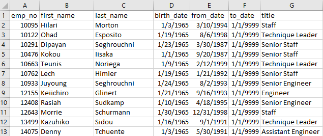

# Pewlett-Hackard-Analysis

## Mentorship Program V 1.0
The purpose of the analysis was to determine which current employees are near retirement agea and are also in leadership posisitions. Management would like to reach out to employees which meet the specific queried criteria to determine if the employees would be interested in participating in an internal mentorship program. 

The program is designed to help Pewlett-Hackard ease the transition between generations of employees. 

Digging into the data we found 1,550 employess that qualified for the Pewlett-Hackard mentorship program. In our final list of employees we were able to present to the management team. 

The majority of mentoriship candidates are classified as "Senior Staff". It would likely help the management team to attempt to narrow the definition of "Senior Staff" in order to broaden the scope and effectiveness of the mentorship program.

## Retirement Preparation
Based on our analysis, more than 41,000 employess may consider retirement within the next 5 years. Analyzing the job responsibilities and seniorty of each employee within the retirement time frame will help management determine where the most mentorship and training resources should be allocated over the next 5 years. 

Pewlett-Hackard has over 300,000 employess and only 1,550 meet the mentorship criteria. That makes up just 0.52% of total employment. Management may want to consider expanding the criteria which qualify an employee for mentorship status. With an average of 193 employees per mentor it is unlikley that one mentor would be able to have a meaningful impact on the company or his/her mentorees. 

## Management Recommendations
Based on our analysis we advise widening the criteria which determines what employees qualify for the mentorship program. Mangement should consider the number of menteorees a single mentor may be able to take on while providing quality training and teaching experience. The current list of employees is unlikely to provide Pewlett-Hackard with enough mentorship employees to overcome the "silver tsunami". By widening the classification of mentorship candidates Pewlett-Hackard can expand their reach and make sure the next generation of departmnet leadership understands the successes, weaknesses, and challenges of the current team. 